# product 구현중 - 제출 안까먹게 미리 제출, 비밀번호 가리기 구현 예정
# spartamarket-DRF
우리를 위한 중고거래 :: 스파르타 마켓(DRF)

### 사용 프로그램
python 3.10\
django\
그 외 패키지 - requirements.txt

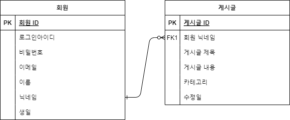

## 기능
회원가입
- **Endpoint**: **`/api/accounts`**
- **Method**: **`POST`**

성공\
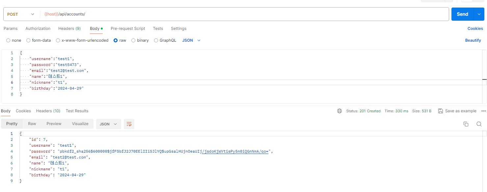\
실패\
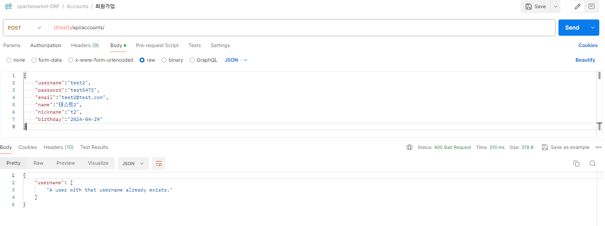\
실패 - 이메일\

로그인
- **Endpoint**: **`/api/accounts/login`**
- **Method**: **`POST`**

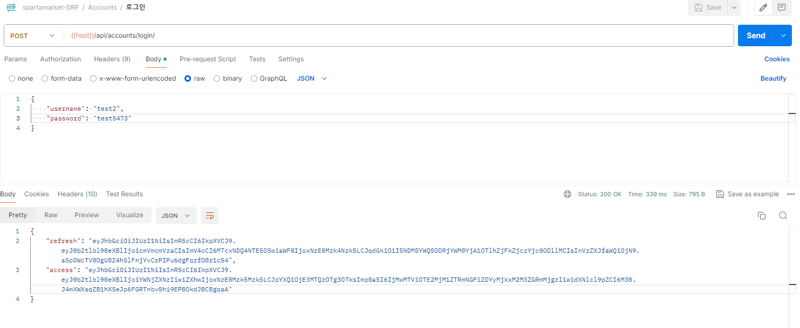

프로필 조회-
- **Endpoint**: **`/api/accounts/<str:username>`**
- **Method**: **`GET`**

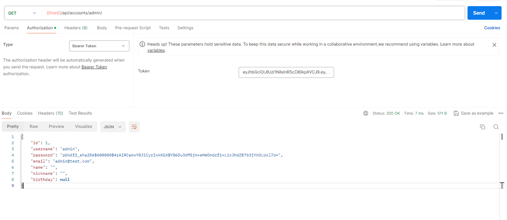

상품 등록
- **Endpoint**: **`/api/products`**
- **Method**: **`POST`**

성공\
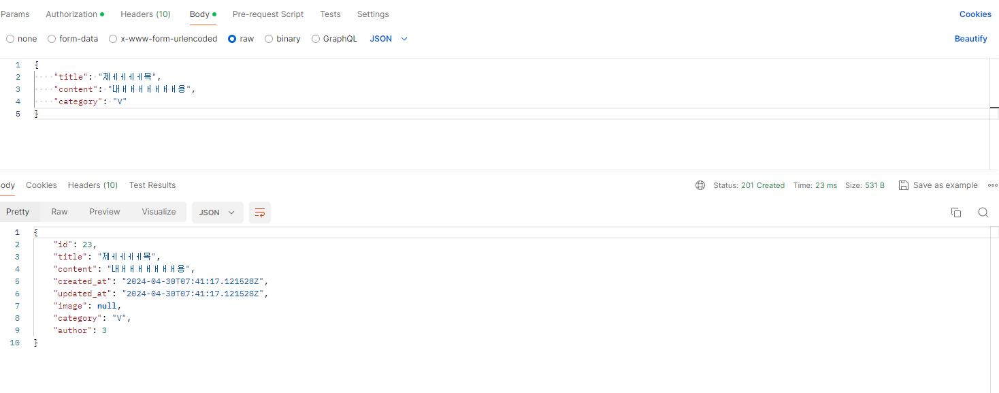\
실패\
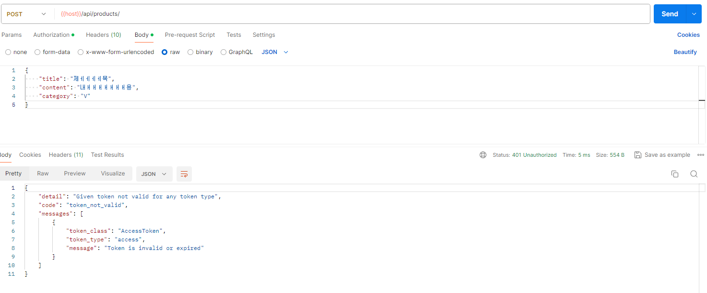

상품 목록 조회
- **Endpoint**: **`/api/products`**
- **Method**: **`GET`**

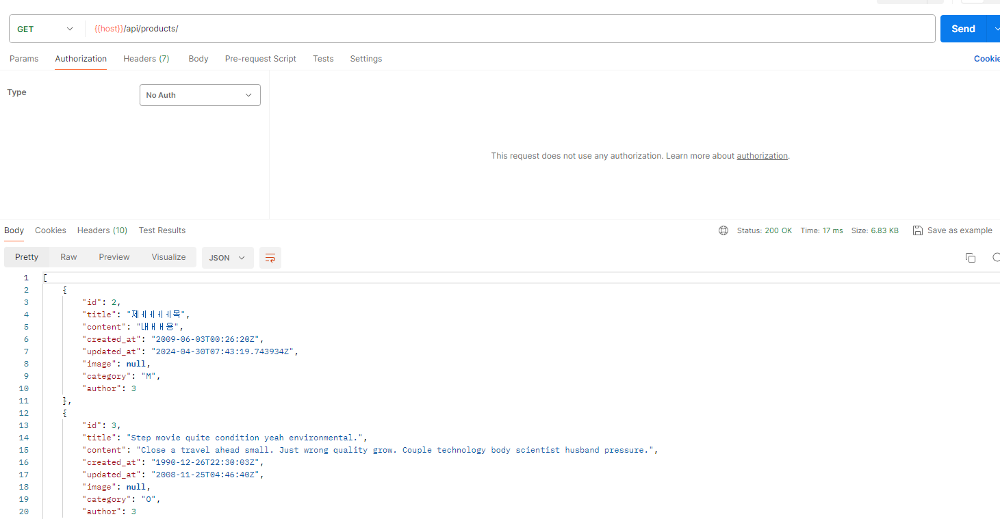

상품 수정
- **Endpoint**: **`/api/products/<int:productId>`**
- **Method**: **`PUT`**

성공\
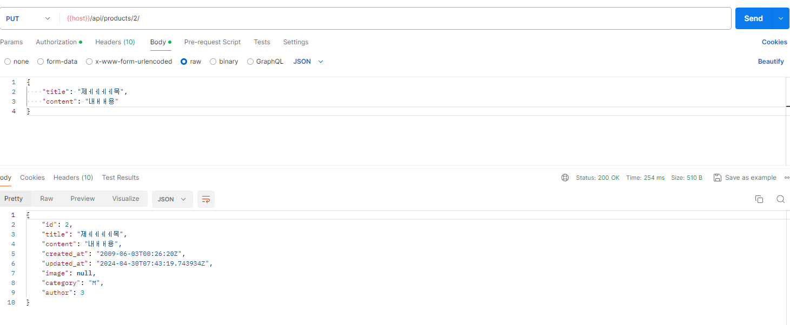\
실패\

상품 삭제
- **Endpoint**: **`/api/products/<int:productId>`**
- **Method**: **`DELETE`**

성공\
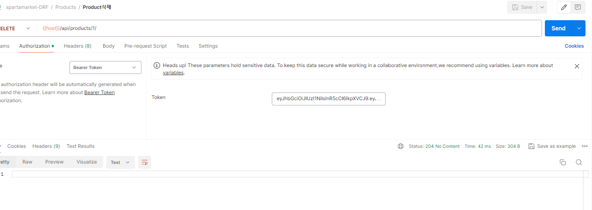\
실패\
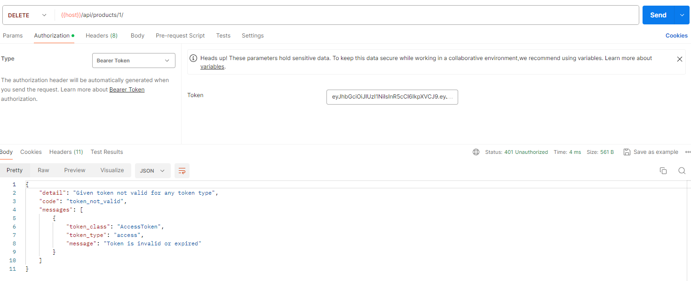
